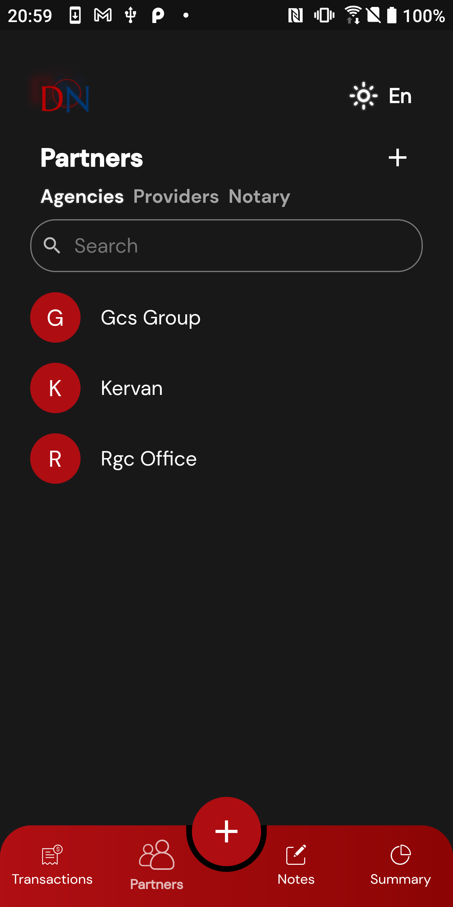

# work_management_app_for_general_service_offices

## Images

 
 

## Showcase implementations of:

* [x] Use of Getx echo system
* [x] MVCS architecture in conjuction with repository pattern
* [x] Fake and Remote data repositories implementation
* [x] MongoDb integration
* [x] Local storage with secure_storage
* [x] Nested Forms
* [x] Advance data filtering
* [x] data charts and analysis
* [x] Pdf and Excel reports generation
* [x] Multi_theme support
* [x] Multi_languages support
* [x] Global connection checker
* [x] Triggering actions on AppLifeCycle Changes

## About app
This show case project allow users to do CRUD operations on business assets
with the ability to filter, search and generate monthly Pdf reports for any asset
such as (agency,client etc..) to evaluate its own works.

also it helps following up the business transactions states and keep notes.

there is also a summary tab to observe annual performance and analyse business data in additional to the ability
to generate an annual excel report with all details.

## How to run
in order to start using the application you should follow these steps:
* 1- clone or download the source code.
* 2- open the source code with your id and run pub.get
* 3- the app supports remote and fake data repositories so:
  * A- if you want to run the app with remote data you should add your own MongoDb connection String, Username and Password to the MongoDbApi file
      and make sure to inject RemoteDataRepositories in the app_bindings.dart file
  * B- if you want to run the app with fake data you should inject FakeDataRepositories in the app.bindings.dart file,
      the data are saved in the dummy_data.dart file inside the constants folder

* after applying the above steps you should be ready to go.

### Install
You can download and try the app demo on android from the [App Link](https://play.google.com/store/apps/details?id=com.devnejim.trackmyjob) on Play Store 

### Contact Me
- LinkedIn: [Abdulaziz Aboujib](https://www.linkedin.com/in/abdul-aziz-aboujib-5a34461b2/)
- Email: Abdulaizizz.94@gmail.com

